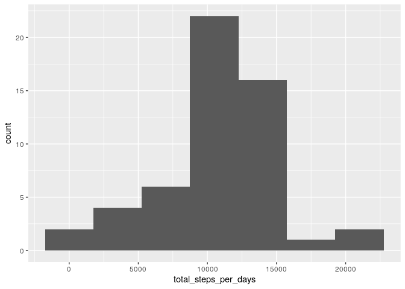
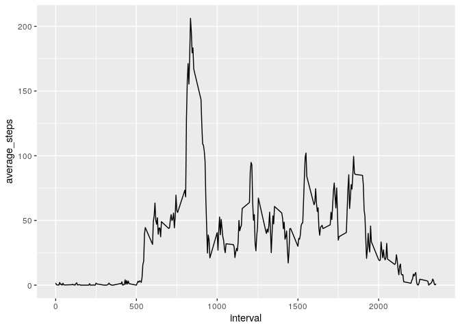
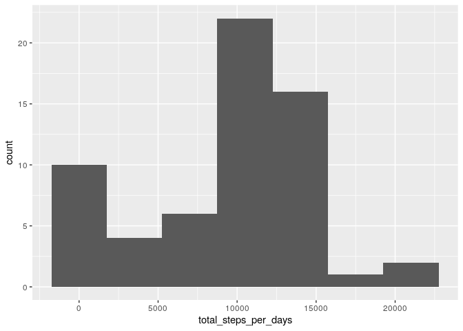
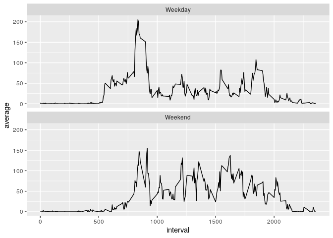

    ```r
    knitr::opts_chunk$set(fig.path='figure/')
    ```

Data
----

The data is from a personal activity monitoring device. This device
collects data at 5 minute intervals through out the day. The data
consists of two months of data from an anonymous individual collected
during the months of October and November, 2012 and include the number
of steps taken in 5 minute intervals each day

------------------------------------------------------------------------

Research Questions
------------------

This analysis aims to answer the following questions:

-   What is mean total number of steps taken per day?
-   What is the average daily activity pattern?
-   Are there differences in activity patterns between weekdays and
    weekends?

------------------------------------------------------------------------

Setup
-----

### Load Packages

    library(tidyverse)

    ## ── Attaching packages ───────────────────────────────────────────────── tidyverse 1.3.0 ──

    ## ✓ ggplot2 3.3.0     ✓ purrr   0.3.3
    ## ✓ tibble  3.0.0     ✓ dplyr   0.8.5
    ## ✓ tidyr   1.0.2     ✓ stringr 1.4.0
    ## ✓ readr   1.3.1     ✓ forcats 0.5.0

    ## ── Conflicts ──────────────────────────────────────────────────── tidyverse_conflicts() ──
    ## x dplyr::filter() masks stats::filter()
    ## x dplyr::lag()    masks stats::lag()

### Load Data

    data <- read_csv("activity.csv",col_types = cols(
      steps = col_integer(),
      date = col_date(),
      interval = col_integer()
    ))

------------------------------------------------------------------------

Exploratory Data Analysis
-------------------------

    glimpse(data)

    ## Rows: 17,568
    ## Columns: 3
    ## $ steps    <int> NA, NA, NA, NA, NA, NA, NA, NA, NA, NA, NA, NA, NA, NA, NA, …
    ## $ date     <date> 2012-10-01, 2012-10-01, 2012-10-01, 2012-10-01, 2012-10-01,…
    ## $ interval <int> 0, 5, 10, 15, 20, 25, 30, 35, 40, 45, 50, 55, 100, 105, 110,…

A glimpse into the data shows us that we got twp variables which are
integer and one that’s date, we also see there’s some missing values
which we’ll deal with later.

**Research Question 1:** What is mean total number of steps taken per
day?

    (d1 <- data %>% 
      group_by(date) %>%
      drop_na() %>% 
      summarise(
        total_steps_per_days = sum(steps),
        mean_steps_per_days = mean(steps),
        median_steps_per_days = median(steps)))

    ## # A tibble: 53 x 4
    ##    date       total_steps_per_days mean_steps_per_days median_steps_per_days
    ##    <date>                    <int>               <dbl>                 <dbl>
    ##  1 2012-10-02                  126               0.438                     0
    ##  2 2012-10-03                11352              39.4                       0
    ##  3 2012-10-04                12116              42.1                       0
    ##  4 2012-10-05                13294              46.2                       0
    ##  5 2012-10-06                15420              53.5                       0
    ##  6 2012-10-07                11015              38.2                       0
    ##  7 2012-10-09                12811              44.5                       0
    ##  8 2012-10-10                 9900              34.4                       0
    ##  9 2012-10-11                10304              35.8                       0
    ## 10 2012-10-12                17382              60.4                       0
    ## # … with 43 more rows

One thing to notice here is that most of the medians are null, that’s
because there’s a lot of 5 minute intervals where the person doesn’t
walk any steps which is reasonable.

    d1 %>% 
      count(total_steps_per_days)

    ## # A tibble: 53 x 2
    ##    total_steps_per_days     n
    ##                   <int> <int>
    ##  1                   41     1
    ##  2                  126     1
    ##  3                 2492     1
    ##  4                 3219     1
    ##  5                 4472     1
    ##  6                 5018     1
    ##  7                 5441     1
    ##  8                 6778     1
    ##  9                 7047     1
    ## 10                 7336     1
    ## # … with 43 more rows

    ggplot(d1,aes(x = total_steps_per_days)) +
      geom_histogram(binwidth = 3500)



We see here that the person make a number of steps around 10000 quite
often, and if we look at the table above, we’ll notice is only during
certain days so it might be related to work.

**Research Question 2:** What is the average daily activity pattern?

    d2 <- data %>% 
      group_by(interval) %>% 
      drop_na() %>% 
      summarise(average_steps = mean(steps))

    ggplot(d2,aes(x = interval,y = average_steps)) +
      geom_line()



From this plot we can see that there’s one peak in the average steps and
the rest of the day it’s around 100 which could suggest indoor movement.

    d2 %>% 
      arrange(desc(average_steps)) %>% 
      top_n(1,average_steps)

    ## # A tibble: 1 x 2
    ##   interval average_steps
    ##      <int>         <dbl>
    ## 1      835          206.

The maximum average steps is done in the interval 835 which in hours is
around 13 hours, so if the 0th interval correspond to midnight, it would
be 1pm, this timing might suggest going to lunch

**Imputing missing values**

    data %>% 
      filter_all(any_vars(is.na(.))) %>% 
      count()

    ## # A tibble: 1 x 1
    ##       n
    ##   <int>
    ## 1  2304

    new_data <- data %>% 
      group_by(interval) %>% 
      mutate(steps = ifelse(is.na(steps),median(steps,na.rm = T),steps))

I chose to fill missing values with the median of the corresponding
interval.

    (d3 <- new_data %>% 
      group_by(date) %>%
      drop_na() %>% 
      summarise(
        total_steps_per_days = sum(steps),
        mean_steps_per_days = mean(steps),
        median_steps_per_days = median(steps)))

    ## # A tibble: 61 x 4
    ##    date       total_steps_per_days mean_steps_per_days median_steps_per_days
    ##    <date>                    <int>               <dbl>                 <dbl>
    ##  1 2012-10-01                 1141               3.96                      0
    ##  2 2012-10-02                  126               0.438                     0
    ##  3 2012-10-03                11352              39.4                       0
    ##  4 2012-10-04                12116              42.1                       0
    ##  5 2012-10-05                13294              46.2                       0
    ##  6 2012-10-06                15420              53.5                       0
    ##  7 2012-10-07                11015              38.2                       0
    ##  8 2012-10-08                 1141               3.96                      0
    ##  9 2012-10-09                12811              44.5                       0
    ## 10 2012-10-10                 9900              34.4                       0
    ## # … with 51 more rows

    ggplot(d3,aes(x = total_steps_per_days)) +
      geom_histogram(binwidth = 3500)



Overall the histogram doesn’t seems to differ from the first one,
however there’s a slight difference, we see that there’s another peak
around 100 steps which, like stated previously, might imply indoor
movement.

**Research Question 3:** Are there differences in activity patterns
between weekdays and weekends?

    new_data %>% 
      mutate(day_type = ifelse(weekdays(date) %in% c("Saturday","Sunday"),"Weekend","Weekday")) %>%
      group_by(interval,day_type) %>% 
      summarise(average = mean(steps)) %>% 
      ggplot(aes(x = interval, y = average)) +
        geom_line() +
        facet_wrap(~day_type,nrow = 2)



We can see that there’s higher day activity during the weekends than
during weekdays, this might suggest that the person likes walking
outside and exercising during weekends.

------------------------------------------------------------------------
